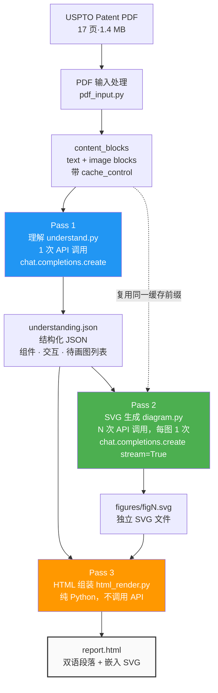
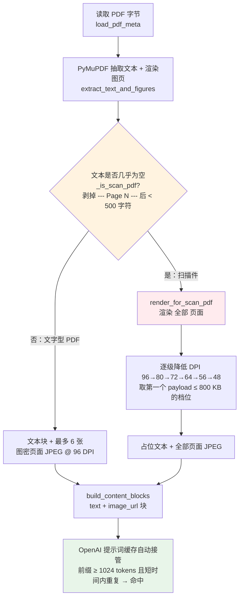
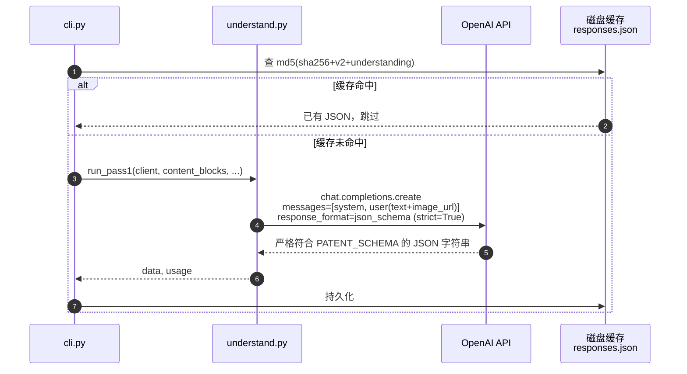
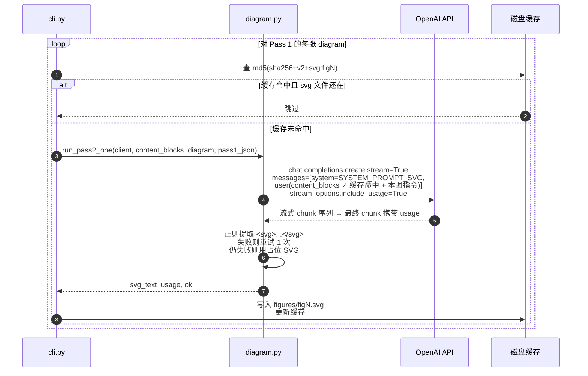
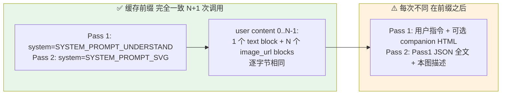
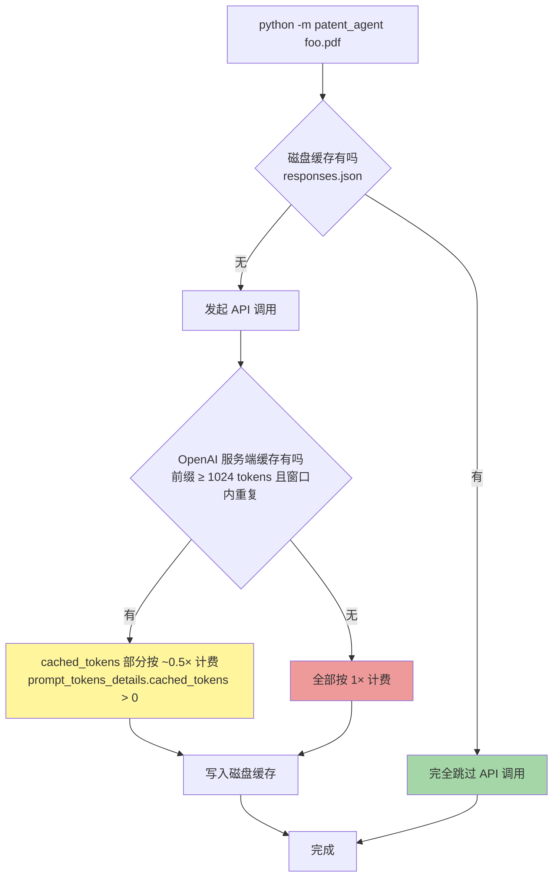

# Patent Agent · USPTO 专利智能分析

把一份 USPTO 专利 PDF 喂进去，吐出一份**中英双语**的 HTML 报告，
里面带有**模型自己绘制的 SVG 系统交互图**。

专利的文字描述往往刻意写得宽泛抽象（为了最大化权利要求范围），
本工具的目标是**穿透这层抽象**：让模型识别出真正的系统组件、
组件之间的交互、流动的数据/信号，并把它可视化出来。

> 模型调用走 **OpenAI Chat Completions API**（含自家或代理转发的兼容端点）。
> 流水线设计与具体模型解耦——把 system prompt、PDF 内容块固定为
> 不变前缀，让 OpenAI 的提示词缓存在 Pass 1 / Pass 2 之间自动命中。

---

## 1. 整体工作流程

整个流程是一个**三遍流水线**（three-pass pipeline），每一遍都有
明确的职责，由 `patent_agent/cli.py` 编排。



**为什么分三遍而不是一次大调用？**
一次性的大 prompt 在 SVG 布局和组件命名上都不可靠。
把"理解"和"画图"拆开，让 Pass 1 先把词汇表（组件 ID、交互标签）固化下来，
Pass 2 只负责按这份词汇表渲染图。Pass 3 完全没有 LLM，只是模板拼装。

---

## 2. PDF 输入处理（含扫描件回退）

USPTO 的 PDF 有两类：**可提文字的数字 PDF** 和**整页图像的扫描件**。
两者处理方式完全不同，由 `pdf_input.py` + `cli.py` 自动判断。



**为什么要降 DPI？** Tesla 那份测试专利就是纯扫描件，17 页全部是
整页图像。要让模型看到 全部 页面才能读到正文/权利要求/附图，
所以必须渲染所有页面，但又要塞进代理常见的 1 MB body 限制。

> 实测：17 页扫描件，DPI 96 → 2.83 MB（超限），DPI 48 → 714 KB（通过）。
> 自动降档算法保证 payload 一定 < 800 KB。

---

## 3. Pass 1 · 理解

**一次 API 调用** → 一个结构化 JSON 对象。



Pass 1 输出（见 `schema.py`）：

| 字段 | 内容 |
|---|---|
| `title_en` / `title_zh` | 双语标题 |
| `abstract_en` / `abstract_zh` | 双语摘要 |
| `background_en` / `background_zh` | 双语背景 |
| `components[]` | 规范化的组件清单：id, name (EN/ZH), description, role |
| `interactions[]` | 组件间交互：from, to, label, data_or_signal, sequence_hint |
| `diagrams[]` | 3–6 张该画的图：id, type, purpose, focused_component_ids |
| `key_claims[]` | 3–7 条核心权利要求（重述，非逐字抄录） |
| `novel_aspects[]` | 2–5 条相对于先有技术的创新点 |

关键参数：
- **`response_format={"type": "json_schema", "json_schema": {"strict": True, ...}}`**
  开启严格结构化输出，模型只能产出与 `PATENT_SCHEMA` 完全匹配的 JSON。
- **`max_tokens=16000`** — Pass 1 输出上限。
- 没有 Anthropic 专属的 `thinking` / `output_config.effort` 字段
  （OpenAI 走 chat completions 不接受这些参数；如果换成 o1/o3 系列再加
  `reasoning_effort`）。

---

## 4. Pass 2 · 每图一张 SVG

对 Pass 1 列出的每张图，独立做一次**流式** API 调用，让模型直接写
原始 SVG 标记。流式是为了避开长输出在慢端点上的 HTTP 超时。



Pass 2 给模型的硬约束（见 `diagram.py:build_svg_instruction`）：
- `viewBox="0 0 1200 800"` 固定画布
- 调色板按 `role` 配色：controller 蓝、sensor 绿、actuator 橙、bus 紫…
- 每个节点都要带**两行文字**（英文 14px 粗体 + 中文 12px 灰色 tspan）
- 每条连线英文标签直接放在线上，中文标签塞进 `<title>` 子元素当 hover tooltip
- 总字节 ≤ 30 KB
- 禁止 `<image>` / `<foreignObject>` / `<script>` / 外部引用

---

## 5. 提示词缓存策略 · 全流水线的核心成本杠杆

OpenAI 的提示词缓存是**自动**的：对于长度 ≥ 1024 tokens 且在短时间窗口内
重复出现的前缀，命中时按更低的费率计费（一般是 0.5× 输入价格，部分
模型上更便宜）。无需在请求里写任何 `cache_control` 标记——只要前缀
**逐字节相同**就行。



**实际成本表现**（Tesla 17 页扫描件，扁平估算）：

| 调用 | prompt_tokens | cached_tokens | 输出 | 备注 |
|---|---|---|---|---|
| Pass 1 | ~50K | 0 | ~8K | 首次填充缓存（按全价计） |
| Pass 2 第 1 张图 | ~50K | ~45K（0.5×）| ~10K | 前缀命中缓存 |
| Pass 2 第 2..5 张图 | ~50K | ~45K | ~10K | 同上 |

→ N 张图大约只比 1 张图贵了"N × 输出 tokens"。

**会**悄无声息打破缓存的几件事（避雷）：
- 在 system prompt 或前缀里放 `datetime.now()` / UUID
- `json.dumps` 没加 `sort_keys=True`（Pass 2 在前缀**之后**注入 Pass 1 JSON，
  必须排序保持稳定，否则后续调用的前缀-后语义会变）
- 把 companion HTML 放到 content_blocks 里面（应放在前缀之后）
- Pass 1 和 Pass 2 用不同 model
- 调整 PDF 渲染 DPI 后没 `--force`：图像数据变了，但磁盘缓存把它给挡了——
  跑出来的还是旧结果，需要 `--force` 才能让 API 看到新图

---

## 6. 双层缓存（API 缓存 + 磁盘缓存）



- **磁盘缓存** `output/.cache/responses.json`：MD5(sha256 + PROMPT_VERSION + tag)
  keyed，原子写入，跨次运行存活。同一份 PDF 跑第二次几乎零成本。
- **API 缓存**：OpenAI 端的自动前缀缓存。同一次运行内 Pass 1 → Pass 2 × N
  全部命中。
- `--force` 跳过磁盘缓存，但 API 缓存仍然生效。

---

## 7. 模块结构

```
patent_agent/
├── __main__.py       # python -m patent_agent → cli.main()
├── cli.py            # argparse + 三遍调度
├── config.py         # 常量：模型、prompt、调色板、SVG viewBox
├── schema.py         # PATENT_SCHEMA（Pass 1 结构化输出契约）
├── cache.py          # ResponseCache（磁盘缓存，原子写）
├── pdf_input.py      # PDF → text + figures + OpenAI 形态的 content_blocks
├── understand.py     # Pass 1（chat.completions.create + json_schema strict）
├── diagram.py        # Pass 2（chat.completions.create stream=True，每张图一次）
└── html_render.py    # Pass 3（纯 Python f-string 模板）
```

---

## 8. 安装与使用

```bash
pip install -r requirements.txt
# requirements.txt:
#   openai>=1.50
#   pymupdf>=1.24
```

设置 API 凭据（Windows PowerShell）：

```powershell
$env:OPENAI_API_KEY = "sk-..."
# 可选：通过反向代理或自托管 OpenAI 兼容端点
$env:OPENAI_BASE_URL = "https://your-proxy.example.com/v1"
```

运行：

```bash
python -m patent_agent tesla-20260121885.pdf --verbose
```

常用参数：

| 参数 | 默认 | 作用 |
|---|---|---|
| `--companion-html PATH` | 无 | 附带的 USPTO HTML 源（只在 Pass 1 用） |
| `--output-dir DIR` | `outputs/<pdf-stem>` | 输出目录 |
| `--model NAME` | `claude-opus-4-7` | 模型 ID（默认沿用 Claude 名称——若你的 OpenAI 端点不识别请改成 `gpt-4o-2024-08-06` 等）|
| `--api-key`, `--base-url` | 取自 `OPENAI_API_KEY` / `OPENAI_BASE_URL` | 显式覆盖 |
| `--force` | off | 忽略磁盘缓存，重跑两遍 |
| `--skip-svg` | off | 跳过 Pass 2，复用已有 SVG |
| `--max-diagrams N` | 8 | Pass 2 的图数上限 |
| `--max-figure-pages N` | 6 | 文字 PDF 渲染图密页面数量上限 |
| `--dpi N` | 96 | 渲染 DPI（扫描件回退会自动调低）|
| `--verbose` | off | 输出 per-call usage 到 stderr |

**退出码**：`0` 成功 / `1` 输入错误 / `2` API 错误 / `3` SVG 解析失败（仍写入占位图）。

---

## 9. 输出结构

```
outputs/tesla-20260121885/
├── report.html              ← 最终交付物：浏览器打开看
├── understanding.json       ← Pass 1 的原始 JSON，便于人工核查
├── figures/
│   ├── fig1.svg             ← Pass 2 生成的独立 SVG，HTML 用 <object> 引用
│   ├── fig2.svg
│   └── ...
├── run.log                  ← model · prompt_version · 各类 token 用量
└── .cache/
    └── responses.json       ← 磁盘缓存
```

`report.html` 的章节（顺序）：

1. 头部：专利号、发明人、申请人 + 双语标题
2. Abstract（段落配对：英文段 + 中文段）
3. Background（同上）
4. Components 表（ID · 名字 EN/ZH 叠 · 描述 EN/ZH 叠 · role）
5. Interactions 表（ID · from · to · label EN/ZH · 数据/信号 · 顺序）
6. Diagrams 区（每张：双语标题 + 用 `<object>` 嵌入的 SVG + 双语 purpose）
7. Key Claims（block quote，带 importance badge）
8. Novel Aspects（双语项目列表）
9. Footer：模型、累计 cache_read、生成时间戳

---

## 10. 故障排查

| 现象 | 原因 | 解决 |
|---|---|---|
| `413 Request Entity Too Large` | 代理 body 限制 < payload | 降 `--dpi` 或 `--max-figure-pages`；扫描件会自动降档 |
| `JSONDecodeError: Expecting value` | API 返回了 HTML/空响应（端点 URL 错 / 鉴权失败 / 端点不支持 chat.completions） | 用 `curl -X POST $OPENAI_BASE_URL/chat/completions -H "Authorization: Bearer $OPENAI_API_KEY"` 验证；确认 base URL 结尾是 `/v1` 之类的 OpenAI 兼容路径 |
| 模型不认 `response_format=json_schema` | 端点是老版本或非严格兼容 | 临时改 `understand.py` 里 `response_format={"type":"json_object"}` 兜底（语义弱化） |
| `cached_tokens` 始终 = 0 | 缓存前缀某处字节变了；或端点未启用前缀缓存 | 检查 system prompt / content_blocks 是否完全一致；某些代理不透传 OpenAI 缓存计数 |
| 摘要少于 50 字符 | PDF 是扫描件 + 自动回退仍失效 | 提高 `target_payload_bytes`（前提是代理允许） |
| SVG 占位图（黄色 fallback） | 模型连续两次没产出可解析 SVG | 检查 `run.log` 的 `svg_failures` 列表，手工跑 `--force` 重试 |

---

## 11. 单次成本粗算（参考）

> 以下数字是基于 Claude Opus 4.7 / Anthropic 旧定价的参考估算，实际取决于
> 你选用的 OpenAI 模型与端点。OpenAI 端的提示词缓存通常给 ~50% 折扣
> （而非示意中的 0.1×），所以下面的"cache_read"行价格更高、cache_create 行
> 不再单列。把它当数量级参考。

| 项目 | tokens | 说明 |
|---|---|---|
| Pass 1（首次填充缓存） | ~50K 输入 + ~8K 输出 | 全价 |
| Pass 2 × 5 张图 输入（含缓存命中） | 5 × 50K，其中 ~45K cached | cached 部分按 ~0.5× 计费 |
| Pass 2 × 5 张图 输出 | 5 × 10K | 全价 |

主要成本来自**输出 tokens**，所以 `--max-diagrams` 是最有效的成本旋钮。


## 12. Prompt-log
```
------------------------------------------------
我正在分析专利，专利描述的一般比较宽泛模糊，通常贴了图片来解释专利内容，我计  
    划开发一个agent，可以帮助通读专利，解释，最终输出成一个html文件，要求必须用sv 
    g来实现专利中描述的系统交互关系，我该如何进行。
我必须明确一下，我给你的输入是pdf格式的，比如根路径下的tesla-xxxxx.pdf，有可  
能会搭配一个html格式US-20260121885_USPTO.html的文件，但是大部分情况下只会有pd 
f的，因此你需要阅读pdf
--------------------------------------------------


```